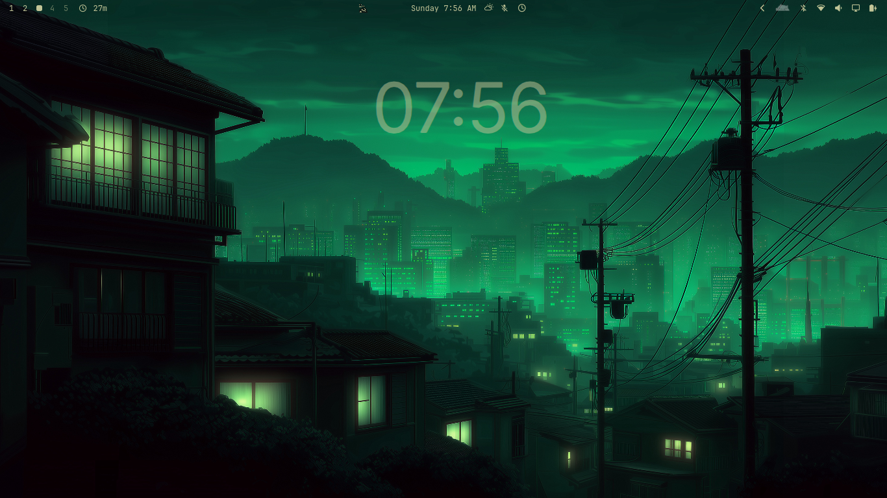

# OmaClock

A simple, minimal desktop clock widget for [Omarchy](https://omarchy.org/) that
renders **behind all of your open windows** on the bottom layer — a clean,
click-through time display living on your desktop like a wallpaper.



## Features

- Renders behind every app window on the bottom layer (click-through; desktop
  and wallpaper interactions keep working).
- **Bar widget control** — the plugin also adds an "OmaClock" button to the
  status bar (next to the clock). Click it to open a panel with **Size**,
  **X position**, and **Y position** sliders, a color picker, and a reset
  button. Changes apply live and are saved automatically.
- **Theme-aware color** by default: matches your top status bar's text color
  (`Color.bar.text`). Pin it to any theme palette role (foreground,
  background, accent, muted, …) or set a custom hex color.
- Fully configurable time format — 12-hour, 24-hour, with seconds, and optional
  AM/PM (e.g. `1:30`, `13:30`, `1:30 PM`, `1:30:05`).
- Bundled **Inter** typeface (OFL) as the default font — no system install
  needed. Also bundles **Plus Jakarta Sans** (OFL) as an optional Apple-like
  alternative, and you can use any installed system font.
- Adjustable size, weight, letter spacing, opacity, and on-screen position.
- A single `config.json`, hot-reloaded (~2s) on save.

## Install

```bash
omarchy plugin add https://github.com/ubeyidah/omaclock
omarchy restart shell
```

## Control

The clock is controlled from the **OmaClock** button the plugin puts in the
status bar (left of the center clock):

- **Size** — 5–45% of screen height.
- **X position / Y position** — 0–100% of the screen.
- **Color** — three modes:
  - **Auto**: follows the top bar's text color (theme/wallpaper-aware).
  - **Theme**: pick any theme palette role from the swatches (Bar text,
    Foreground, Background, Accent, Muted, Urgent, Popup text). Swatches track
    the active theme live.
  - **Custom**: type a hex color (e.g. `#ffcc00`) and hit Apply.
- **Reset** — restores the centered position and default size.

Everything is written to `~/.config/omaclock/config.json`, so manual editing is
optional.

### Options

| Key             | Default             | Description                                                                 |
|-----------------|---------------------|-----------------------------------------------------------------------------|
| `format`        | `h:mm`              | Qt time format. `h:mm` = 12h, `HH:mm` = 24h, `h:mm AP` = 12h with AM/PM, `h:mm:ss` = with seconds. |
| `showSeconds`   | `false`             | Tick every second instead of every minute.                                  |
| `fontFamily`    | `""`                | Font: `""` = bundled **Inter** (default); `"system"` = platform default font; any other name = that family (e.g. `"Plus Jakarta Sans"`). |
| `fontWeight`    | `200`               | Numerals weight, 100–900 (200 = thin, 400 = regular).                      |
| `fontScale`     | `0.15`              | Font size as a fraction of screen height (0.15 = 15%).                     |
| `letterSpacing` | `-3`                | Extra spacing between numerals (negative tightens them).                   |
| `colorMode`     | `auto`              | Color source: `auto` (bar text color) / `theme` (palette role) / `custom` (hex). |
| `colorRole`     | `bar.text`          | Theme palette role used when `colorMode` is `theme`: `bar.text`, `popups.text`, `foreground`, `background`, `accent`, `muted`, `urgent`. |
| `color`         | `""`                | Custom hex color used when `colorMode` is `custom` (e.g. `#ffffff`). Legacy configs with only `color` set still work as custom. |
| `opacity`       | `0.92`              | Clock opacity, 0–1.                                                         |
| `position`      | `top`               | Vertical anchor used when `yRatio` is not set: `top` / `center` / `bottom`. |
| `yRatio`        | `0.20`              | Vertical position as a 0–1 ratio of screen height (overrides `position`).   |
| `xRatio`        | `0.5`               | Horizontal position as a 0–1 ratio of screen width.                        |
| `namespace`     | `ubeyidah.omaclock` | Layer namespace (advanced; normally leave unchanged).                       |

### Color & theming

With `colorMode` left at `auto`, the clock uses the exact color Omarchy uses
for the top status bar's text (`Color.bar.text`), so it stays in sync with the
theme and wallpaper just like the bar — updating the moment you switch themes
(`omarchy theme set …`).

For a theme palette color, set `colorMode` to `theme` and pick a `colorRole`
(swatches in the bar panel do this for you). To pin an arbitrary color, set
`colorMode` to `custom` and give `color` any hex CSS color.

### Fonts

- `""` (default) → bundled **Inter**.
- `"system"` → your platform's default UI font.
- Any other value → that font family, if installed (the bundled **Plus Jakarta
  Sans** is available as `"Plus Jakarta Sans"`).

## Examples

Bigger, centered, with seconds:

```json
{
  "format": "h:mm:ss",
  "showSeconds": true,
  "fontScale": 0.22,
  "position": "center"
}
```

Bar-matching color, Inter, lower on the screen:

```json
{
  "color": "",
  "fontFamily": "",
  "yRatio": 0.80
}
```

Use the system font with a fixed white color:

```json
{
  "fontFamily": "system",
  "colorMode": "custom",
  "color": "#ffffff"
}
```

## Troubleshooting

**Desktop clicks stopped working (e.g. double-click wallpaper switcher).**
On Quickshell 0.3.x the fullscreen clock layer can still capture mouse input
even though it has no interactive elements. Fixed via an empty input mask
(`mask: Region {}`). If you're on an older build, update the plugin:

```bash
omarchy plugin add https://github.com/ubeyidah/omaclock
omarchy restart shell
```

## Uninstall

```bash
omarchy plugin remove ubeyidah.omaclock
```

The plugin only ever draws a transparent layer; removing it leaves no trace.
You can also delete `~/.config/omaclock/config.json` if you no longer want it.

## Troubleshooting & Common Fixes

### OmaClock Clickthrough and Double-Click Fix
If you previously experienced an issue where OmaClock blocked desktop mouse interactions (such as double-clicking the desktop wallpaper):

This bug has been **officially fixed natively** within the core OmaClock repository. The fix implements `mask: Region {}` directly inside the `PanelWindow`.

You **do not need** external standalone installation scripts or community patches to fix this behavior. Simply ensure you are running the latest official version of OmaClock.

## License

- Plugin code: [MIT](LICENSE)
- Bundled Inter font: [SIL Open Font License 1.1](fonts/OFL.txt)
- Bundled Plus Jakarta Sans font: [SIL Open Font License 1.1](fonts/PlusJakartaSans-OFL.txt)
